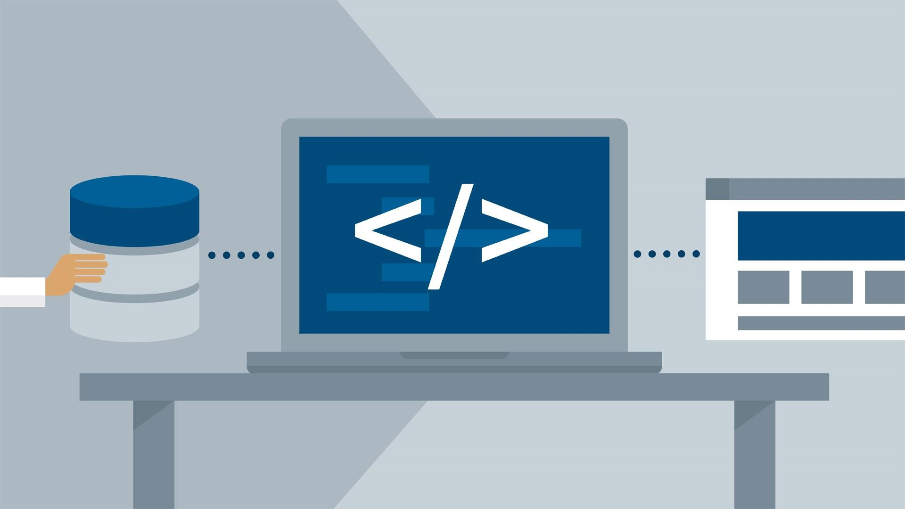
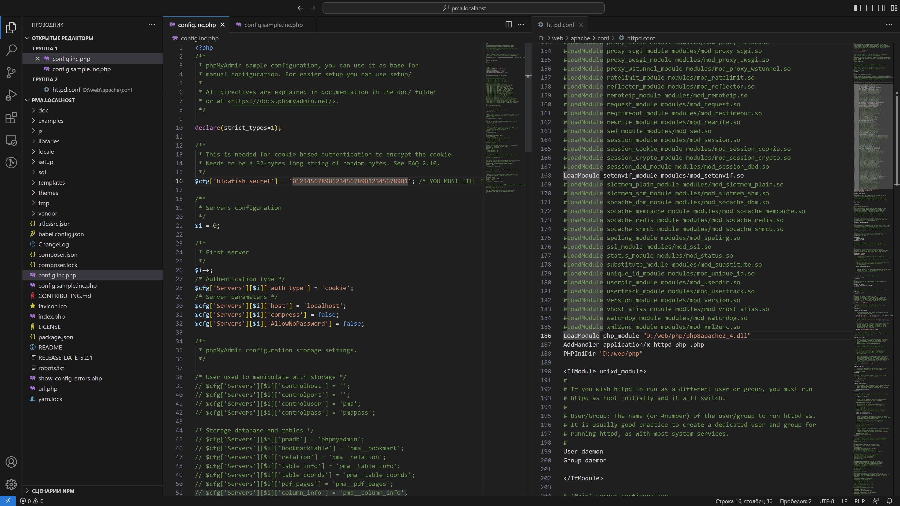
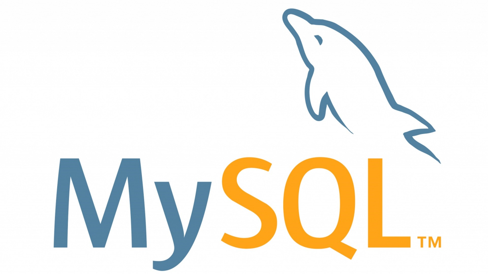
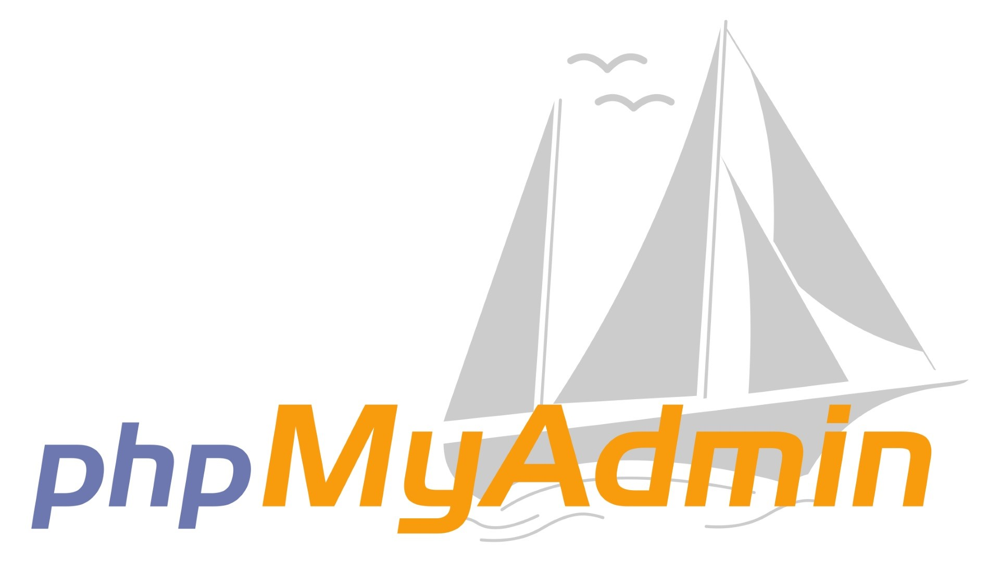

# Устанавливаем на Windows Apache, MySQL и PHP — Нехитрый домашний веб–сервер

Полезно запустить свой локальный веб-сервер хотя бы из любопытства. Понять устройство веба, сделать простенький сайт, втянуться и стать профессиональным разработчиком — проще, чем кажется. Совсем просто одним кликом установить готовый пакет WAMP (Windows: Apache HTTPD, MySQL, PHP), а ещё лучше — разобраться самому.

А чтобы лучше разобраться в веб-серверах давайте вместе установим, самостоятельно настроим и обновим все три компонента: Apache HTTPD 2.4, MySQL 8.0 и PHP 8.2. А заодно разберемся и с phpMyAdmin 5.2.

Если говорить совсем доступно, то заурядному веб-серверу нужны только три вещи: программа для ответа на запросы браузера, в нашем случае это Apache HTTPD, программа для управления базами данных, мы рассмотрим MySQL, и библиотеки для обработки кода на каком-то языке программирования, я поведу речь о PHP. Опционально, но совсем не обязательно, подобрать софт для ручных манипуляций с базами данных. Провайдеры дешевого интернет–хостинга чаще всего дают доступ к phpMyAdmin, а поэтому его используем и мы. Все эти программы совершенно бесплатны, а их код — открыт.

Конечно, базами данных можно управлять иначе, например, через PostgreSQL или SQLite, иначе можно отвечать и на запросы, допустим, через nginx или Microsoft IIS, да и языки можно использовать совершенно другие, скажем, Ruby или Python. Но к 2023 году, вот уже более пятнадцати лет, связка Apache-MySQL-PHP всё ещё остается самой популярной.

Пройдем по чётким пунктам с краткими пояснениями для более глубокого понимания. Если вас интересует только результат — игнорируйте пояснения.

## 1. Подготовьтесь к установке сервера

Visual Studio Code как нельзя лучше подходит как для работы с файлами конфигурации веб-сервера, так и для написания кода

**1.1.** Создайте папку web в корне диска. Лучше использовать диск, на котором не установлена операционная система. Внутри нее создайте 5 подпапок: apache, log, php, tmp и www.

Сервер лучше устанавливать не на тот логический диск, где установлена Windows: чтобы избежать проблем с правами доступа к файлам и случайно не удалить сервер при переустановке системы. Для примера будем использовать диск D.

**1.2.** Установите текстовый редактор кода. Хорошие варианты: [Visual Studio Code](https://code.visualstudio.com/), [Notepad++](https://notepad-plus-plus.org/), [Sublime Text](https://www.sublimetext.com/) и [Brackets](http://brackets.io/).

Редактор не требуется, но с ним удобнее работать: как минимум, редактор нумерует строки и автоматически подсвечивает фрагменты кода разными цветами. Для таких редакторов как VS Code и Atom (и [отдельный](https://packagecontrol.io/) для Sublime) существуют пакетные менеджеры. Установив дополнительные пакеты, вы заставите редактор «подсвечивать» код ещё большего числа языков, а также научите автоматически указывать ошибки, дополнять выражения и делать многое другое. Но в конце–концов можно использовать и встроенный «Блокнот» Windows.

**1.3.** В каталоге D:\web\www создайте файл index.html с текстом `Hello world` и файл index.php с текстом `<?php phpinfo(); ?>`.

HTML–файл необходим для проверки работы веб-сервера Apache HTTPD, который в среде разработчиков чаще называют просто Apache или «апач», хотя это и не совсем верно, ведь так называется группа проектов и стоящая за ними организация Apache Software Foundation, а не одна программа, но это простительная ошибка. Если Apache работает, то в браузере в ответ на обращение к серверу появятся слова Hello world. А вот PHP–файл необходим для проверки работы PHP, о котором ниже. Если PHP работает, то в браузере в ответ на обращение к серверу появятся сведения о конфигурации PHP.

## 2. Установите и настройте Apache HTTPD

Apache HTTPD или просто «апач» чаще всего используется для обработки запросов и отправки сформированных скриптами ответов по протоколам HTTP и HTTPS

**2.1.** Загрузите архив с последней версией Apache HTTPD для 64–разрядной Windows: [httpd-2.4.56-win64-VS17.zip](https://www.apachelounge.com/download/VS17/binaries/httpd-2.4.56-win64-VS17.zip). На всякий случай, проверьте на официальном сайте Apache Lounge нет ли версии новее: [apachelounge.com/download](https://www.apachelounge.com/download/).

Официальная сборка Apache под Windows не выпускается, сборки готовят отдельные организации, самой активной из которых является Apache Lounge. Сам Apache работает по HTTP и в Windows трудится как фоновый процесс, а в Linux — как демон (*англ.* daemon), откуда и название HTTPD. Существует Apache и под 32-битные версии Windows, для них необходима версия Win32, а не Win64. Указанные в имени файла VS17 и VS16 говорят о версии Visual Studio, которой скомпилирован Apache. Выберете самую последнюю версию и установите свежие вспомогательные файлы Visual Studio с официального сайта Microsoft: [vc_redist.x64.exe](https://learn.microsoft.com/ru-RU/cpp/windows/latest-supported-vc-redist?view=msvc-170).

**2.2.** Распакуйте архив и перенесите содержимое папки Apache24 в папку D:\web\apache.

Важно ничего не перепутать и перенести не все содержимое архива, а лишь содержимое подпапки с именем Apache24. В архиве могут быть файлы readme и прочая информация, которая не нужна для работы сервера.

**2.3.** Откройте файл D:\web\apache\conf\httpd.conf. Поиском по файлу найдите и измените значение `SRVROOT` на `D:/web/apache`. Найдите и измените значения `DocumentRoot` и `Directory` на `D:/web/www`.

У Apache несколько файлов с настройками, все они находятся в папке conf (от слова configuration, «конфигурация» в переводе с английского). Основные настройки задаются в файле httpd.conf. Параметр ServerRoot задает корневую папку самой программы Apache, а DocumentRoot и Directory задают корневую папку хоста, то есть ту папку, в которой хранятся файлы сайта. Номера строк с параметрами могут меняться в новых версиях Apache, поэтому я их не привожу, поищите параметры по документам. Чтобы открыть окошко поиска в вашем текстовом редакторе, нажмите Ctrl + F.

**2.4.** В том же файле httpd.conf найдите, раскомментируйте и измените значение `ServerName` на `localhost:80`.

Параметр ServerName задаёт доменное имя, по которому хост (иначе говоря, сайт) будет откликаться. Так повелось, что домен внутри компьютера называют localhost и этот домен соответствует IP–адресу 127.0.0.1. Для обращения к сайту можно использовать как доменное имя, так и IP–адрес. Порт под номером 80 используется в вебе для протокола HTTP без шифрования. Комментарии в файле конфигурации Apache предваряются октоторпом (символом решетки), сервер будет игнорировать такие строки.

**2.5.** В том же файле httpd.conf найдите и измените значение параметра `ErrorLog` на `"D:/web/log/apache-error.log"`, а также значение `CustomLog` на `"D:/web/log/apache-access.log" common`. Сохраните файл httpd.conf с перезаписью.

Как правило, работающий сервер выдает ошибки. Даже опытным разработчикам редко удается их избежать. Параметры `ErrorLog` и `CustomLog` хранят адреса файлов с журналами ошибок сервера. Если с сервером что–то не так — загляните в эти файлы.

**2.6.** Установите Apache через командную строку. Откройте командную строку (или выполните команду cmd в PowerShell) от имени администратора и выполните команду `D:\web\apache\bin\httpd.exe -k install`.

Сервер установится тут же, прямо в режиме командной строки. Если вся подготовка прошла без ошибок — Apache установится, но ещё не запустится. Если захотите удалить Apache, то выполните в командной строке команду `D:\web\apache\bin\httpd.exe -k uninstall`.

**2.7.** Запустите «Диспетчер задач» Windows, перейдите на вкладку «Службы». Найдите Apache2.4 в списке служб, вызовите контекстное меню: так вы сможете запустить, остановить или перезапустить сервер. Запустите сервер.

В файлах сервера Apache для Windows также есть программа Apache Monitor, графический интерфейс, смысл которого ровно такой же: запускать, останавливать и перезапускать службу Apache2.4. Но в последней версии Windows 11 сильно проще попасть в список служб, поэтому смысла пользоваться Apache Monitor больше нет.

**2.8.** Откройте браузер и наберите адрес http://localhost/ или http://127.0.0.1/ — вы должны увидеть надпись Hello world.

Браузер обратится с запросом по 80 порту к тому же компьютеру, на который он установлен, и будет ждать ответа. Если установка Apache прошла без ошибок, но в ответе нет надписи Hello world — проверьте есть ли в каталоге D:/web/www файл index.html и еще раз пройдитесь по всем пунктам. Если все прошло успешно и в ответ вы получили файл index.html, то поздравляю, вы уже можете дополнять его кодом на HTML, CSS и JavaScript и обращаться к файлам по имени хоста.

**2.0.** Обновить Apache легко. Переименуйте папку D:\web\apache в apache_old, распакуйте новую версию Apache в D:\web\apache, перенесите httpd.conf из папки apache_old в папку apache. Если все работает — удалите apache_old.

## 3. Добавьте в Apache виртуальные хосты

Для запуска, остановки и перезапуска «апача» можно запускать Apache Monitor, который расположен в D:\web\apache\bin\ApacheMonitor.exe, но не менее просто перезапускать службу Apache2.4 прямо из «Диспетчера задач»

**3.1.** Откройте файл C:\Windows\System32\drivers\etc\hosts от имени администратора. Добавьте в него строки `127.0.0.1 host1.localhost` и `127.0.0.1 host2.localhost`. Сохраните файл hosts.

Если текстовый редактор не может работать от имени администратора в защищенной папке Windows, то файл host можно скопировать в ничем не защищенную папку. Например, в «Рабочий стол», где его можно отредактировать, сохранить, переместить обратно и подтвердить операцию с административными привилегиями, когда Windows их запросит. Редактор Visual Studio Code может запрашивать привилегии прямо во время сохранения защищенных файлов.

**3.2.** Создайте папки D:\web\www\host1.localhost и D:\web\www\host2.localhost для виртуальных хостов. Внутри каждой папки создайте по файлу index.html с текстом host1 и host2 соответственно, а также по файлу index.php с текстом `<?php phpinfo(); ?>`.

HTML–файлы необходимы для проверки работы новых хостов Apache. Если хост работает, то в ответ на обращение к хосту в браузере появится соответствующий текст.

**3.3.** Создайте папки D:\web\log\host1.localhost и D:\web\log\host2.localhost для журналов ошибок виртуального хоста.

**3.4.** Откройте файл D:\web\apache\conf\httpd.conf. Раскомментируйте строку `Include conf/extra/httpd-vhosts.conf`. Сохраните файл httpd.conf.

Когда Apache увидит, что у него есть доступ к httpd-vhosts.conf, то он перестанет принимать во внимание указанные ранее параметры DocumentRoot, ServerName, ErrorLog и CustomLog в файле httpd.conf. Все эти параметры будут взяты из файла конфигурации виртуальных хостов, а самый первый указанный хост будет считаться за localhost.

**3.5.** Откройте файл D:\web\apache\conf\extra\httpd-vhosts.conf. Опишите виртуальные хосты в следующей нотации, после чего перезапустите Apache:

    <VirtualHost *:80>
        ServerAdmin webmaster@host1.localhost
        DocumentRoot "D:/web/www/host1.localhost"
        ServerName host1.localhost
        ServerAlias www.host1.localhost
        ErrorLog "D:/web/log/host1.localhost/error.log"
        CustomLog "D:/web/log/host1.localhost/access.log" common
    </VirtualHost>

    <VirtualHost *:80>
        ServerAdmin webmaster@host2.localhost
        DocumentRoot "D:/web/www/host2.localhost"
        ServerName host2.localhost
        ServerAlias www.host2.localhost
        ErrorLog "D:/web/log/host2.localhost/error.log"
        CustomLog "D:/web/log/host2.localhost/access.log" common
    </VirtualHost>

**3.6.** Откройте браузер и перейдите по адресам http://host1.localhost/ и http://host2.localhost/ — вы должны увидеть надписи host1 и host2 соответственно.

Если хочется поработать с двумя и более проектами на одном компьютере, то под каждый из них легко создать отдельные виртуальные хосты. Еще один хост легко создать, пройдя по инструкции сначала: создать папку хоста в D:\web\www, папку журналов ошибок в D:\web\log, строку с именем хоста в файле hosts и блок VirtualHost в файле httpd-vhosts.conf.

**3.0.** Сохранить виртуальные хосты при обновлении Apache также легко. Просто не забудьте перенести еще и D:\web\apache_old\conf\extra\httpd-vhosts.conf в новую папку apache.

## 4. Установите и настройте PHP

Несмотря на высокую конкуренцию, PHP остаётся самым распространённым серверным языком программирования с продвинутыми объектно-ориентированными возможностями

**4.1.** Загрузите архив с последней версией PHP для 64–разрядной Windows: [php-8.2.4-Win32-vs16-x64.zip](https://windows.php.net/downloads/releases/php-8.2.4-Win32-vs16-x64.zip). На всякий случай, проверьте на официальном сайте PHP нет ли версии новее: [https://windows.php.net/download/](https://windows.php.net/download/).

Обратите внимание, что вам нужна версия Thread Safe, то есть работающая в нескольких потоках, и она должна быть ближе к версии Visual Studio, с помощью которой был скомпилирован Apache, например — VS16 и VS17. Разрядность должна в точности быть как у Apache, 64-битные версии обозначаются x64, а 32-битные — x86.

**4.2.** Распакуйте архив и перенесите всё его содержимое в папку D:\web\php.

**4.3.** Откройте файл D:\web\apache\conf\httpd.conf. Найдите секцию файла со множеством строк LoadModule и в самый ее конец добавьте две строки, первая — `LoadModule php_module "D:/web/php/php8apache2_4.dll"`, и вторая — `AddHandler application/x-httpd-php .php`.

Отдельная секция настроечного файла Apache посвящена модулям, которые расширяют возможности сервера. Строки можно было бы указать где угодно, но принято указывать их в этой секции. Здесь мы дополняем функциональность сервера библиотекой PHP и указываем расширения файлов c этим языком — .php. Существуют еще сотни популярных и полезных модулей, серьезно улучшающих работу Apache.

**4.4.** В том же файле httpd.conf сразу после секции LoadModule добавьте строку `PHPIniDir "D:/web/php"`.

Директивой PHPIniDir задается адрес файла php.ini. Этот файл содержит множество важных настроек самого PHP: допустимые размеры файлов для обработки, ограничения времени работы скриптов, параметры пользовательских сессий и многое другое.

**4.5.** В том же файле httpd.conf найдите и измените значение `DirectoryIndex` на `index.php index.html`. Сохраните файл httpd.conf с перезаписью.

**4.6.** Перезапустите Apache, откройте браузер и перейдите по адресу http://localhost/ или http://127.0.0.1/ — вы должны увидеть сведения о конфигурации PHP и Apache.

Это значит, что вы все сделали правильно.

**4.7.** Откройте файл D:\web\php\php.ini-development и сохраните его под именем D:\web\php\php.ini.

Изначально php.ini отсутствует из соображений безопасности, владелец сервера должен самостоятельно его создать и проверить.

**4.8.** В файле D:\web\php\php.ini найдите, раскомментируйте и отредактируйте следующие параметры: параметр `extension_dir = "D:/web/php/ext"`, параметр `sys_temp_dir = "D:/web/tmp"`, параметр `extension=mysqli`, параметр `extension=mbstring`, параметр `date.timezone = Europe/Moscow` (укажите свой часовой пояс в соответствии с документацией [php.net/manual/ru/timezones.php](http://php.net/manual/ru/timezones.php)). Сохраните php.ini и перезапустите Apache.

В то время как PHP работает как расширение Apache, у самого PHP также есть множество важных и полезных расширений в виде библиотек, многие из которых идут в комплекте с PHP; прежде чем подключать эти расширения необходимо указать их адрес в параметре extension_dir. По ходу работы большинства популярных скриптов создаются временные файлы, необходимо указать папку для этих файлов в параметре sys_temp_dir. Одно из самых востребованных расширений — mysqli, стандартная библиотека для PHP, которая позволяет подключаться к базам данных под управлением MySQL. При работе с базами нередко нужно разбивать или собирать строки из нескольких мегабайт, для чего будет полезна библиотека mbstring. Также не стоит забывать про свой часовой пояс — он указывается вручную. С этим минимальным набором вы можете выполнять скрипты на PHP, хотя локальной базы данных у вас ещё нет.

**4.0.** Обновить PHP легко. Переименуйте папку D:\web\php в php_old, распакуйте новую версию PHP в D:\web\php, перенесите php.ini из папки php_old в папку php. Если все работает — удалите php_old.

## 5. Установите и настройте MySQL

Сегодня MySQL развивает компания Oracle, которая предлагает и другие серверы баз данных, но MySQL остаётся выбором номер один для сайтов малого и среднего масштабов

**5.1.** Загрузите последнюю версию MySQL Installer для Windows: [mysql-installer-community-8.0.32.0.msi](https://dev.mysql.com/get/Downloads/MySQLInstaller/mysql-installer-community-8.0.32.0.msi). На всякий случай, проверьте на официальном сайте MySQL нет ли версии новее: [dev.mysql.com/downloads/windows/installer/](https://dev.mysql.com/downloads/windows/installer/).

Обратите внимание на то, что это только установщик, и он собран для 32–битных Windows. Уже в ходе установки вы выберете какая версия MySQL вам нужна: для 64– или 32–битных систем.

**5.2.** Установите MySQL Installer. Программа установится без лишних диалогов и сразу запустится с предложением принять лицензионное соглашение и установить уже сам MySQL. Примите лицензионное соглашение.

Установщик пригодится в будущем для обновления MySQL — сам MySQL обновляться не умеет. Если установщик мешает, то его можно удалить и установить снова, когда появится желание обновить MySQL. Программа без труда определит установленную версию MySQL и предложит ее обновить. Новые минорные версии MySQL выходят достаточно часто, не лишним будет периодически заглядывать в установщик. Правда, при выходе мажорного обновления могут потребоваться полное удаление и повторная установка как самой MySQL, так и MySQL Installer.

**5.3.** Выберете тип Custom (*англ.* Индивидуальный) на этапе Choosing a Setup Type (*англ.* Выбор типа установки) и нажмите Next (*англ.* Далее).

Остальные типы установки включают большое количество программ, которые могут и не пригодиться. В любой момент можно будет запустить установку повторно и добавить английскую документацию, примеры, командную строку MySQL, фирменный визуальный редактор, универсальные драйверы ODBC и прочее.

**5.4.** Выберете MySQL 8.0.32 — X64 из древовидного списка MySQL Servers в поле Available Products (*англ.* Предлагаемые продукты), нажатием стрелки перенесите этот пункт в поле Products/Features to be Installed (*англ.* Продукты для установки), нажмите Next, подтвердите установку сервера нажатием Execute, нажмите Next и переходите к конфигурации нажав Next ещё дважды.

Затянутая процедура установки нужна только чтобы исключить неоднозначности и сто раз перепроверить каждый компонент, ведь сервер баз данных может оказаться самым критическим звеном инфраструктуры.

**5.5.** На первом шаге Type and Networking (*англ.* Тип конфигурации и сеть) не меняйте настройки по умолчанию и нажмите Next.

Если у вас будет небольшая база данных, то лучше оставить Development Computer (*англ.* Компьютер для разработки) в поле Config Type (*англ.* Тип конфигурации). Если же база будет большой и потребует много оперативной памяти — взгляните на другие варианты. В форме Connectivity (*англ.* Соединение) всё же лучше ничего не менять.

**5.6.** На втором шаге Authentication Method (*англ.* Метод аутентификации) оставьте Use Strong Password Encryption for Authentication (*англ.* Использовать сильное шифрование паролей для аутентификации) на втором шаге и нажмите Next.

Новый метод проверки подлинности логина и пароля доступа к серверу MySQL намного надежнее, но на 2023 год некоторые движки сайтов его ещё не поддерживают.

**5.7.** На третьем шаге Accounts and Roles (*англ.* Учётные записи и роли) придумайте пароль root–пользователя сервера, проще всего использовать такой же пароль — root, и нажмите Next.

На локальном компьютере некому вас взламывать, сложность пароля не имеет значения. Дополнительные пользователи также вряд ли понадобятся.

**5.8.** На четвёртом шаге Windows Service (*англ.* Сервис Windows) cнимите галочку Start the MySQL Server at System Startup (*англ.* Запускать сервер MySQL при запуске системы) и нажмите Next.

Галочку имеет смысл снять, если вам не нужно чтобы MySQL со всеми базами висел в оперативной памяти с самого запуска Windows. Если памяти не жалко, и вы не будете забывать остановить службу MySQL80, когда она вам не нужна, — автозагрузку можно и оставить.

**5.9.** На пятом шаге Server File Permitions оставьте первый пункт выбранным по умолчанию и нажмите Next.

Выбрать другой аункт стоит только если есть чёткое понимание как следует поменять права пользователя, который получит доступ к файлам баз данных MySQL.

**5.10.** Нажмите Execute. MySQL сервер будет установлен и запущен. Нажмите Finish чтобы выйти из программы установки MySQL — вы вернетесь в MySQL Installer, нажмите Next и Finish уже в нем.

Запустите «Диспетчер задач» Windows и увидите mysqld.exe в фоновых процессах (d расшифровывается как daemon, *англ.* демон, аналог Windows–процессов в системах Linux). Откройте вкладку «Службы» и увидите службу по имени MySQL80, которую вы можете останавливать и запускать по правому клику мыши. Поздравляю, вы установили СУБД MySQL и настало самое время к ней подключиться.

**5.0.** Обновить MySQL ещё легче. Установите или запустите уже установленный MySQL Installer и проверьте в нём обновления. А если понадобится найти сами файлы баз данных под управлением MySQL, например, для переноса на новую мажорную версию, — вы их найдете по пути C:\ProgramData\MySQL\MySQL Server 8.0\Data.

## 6. Установите и настройте phpMyAdmin

На абсолютном большинстве недорогих виртуальных хостингов для редактирования баз данных предлагается именно phpMyAdmin

**6.1.** Загрузите архив с последней версией phpMyAdmin: [phpMyAdmin-5.2.1-all-languages.zip](https://files.phpmyadmin.net/phpMyAdmin/5.2.1/phpMyAdmin-5.2.1-all-languages.zip). На всякий случай, проверьте на официальном сайте phpMyAdmin нет ли версии новее: [phpmyadmin.net/downloads/](https://www.phpmyadmin.net/downloads/).

Обратите внимание на то, что phpMyAdmin (или просто PMA) работает на чистом PHP, это не программа для Windows. Для работы PMA должен быть запущен Apache с модулем PHP.

**6.2.** Распакуйте содержимое phpMyAdmin-5.2.1-all-languages (папка в архиве может быть вложена) в папку D:\web\www\pma.localhost, создайте отдельный виртуальный хост pma.localhost и не забудьте перезапустить Apache.

Конечно, PMA можно просто поместить в отдельную подпапку любого уже настроенного хоста, но экономить на хостах на своем собственном компьютере нет никакого смысла — а отдельный хост удобнее просто для порядка.

**6.3.** Откройте браузер и наберите адрес http://pma.localhost/ — вы должны увидеть окно phpMyAdmin для подключения к серверу MySQL. Введите логин root и пароль root — вы увидите графическое представление своих баз данных.

**6.4.** Опционально: в файле D:\web\www\pma.localhost\config.sample.inc.php найдите параметр `$cfg['blowfish_secret'] = ''`, поставьте в одиночные кавычки строку из 32 произвольных символов, на основе которых будут сгенерированы куки–файлы и сохраните файл под именем D:\web\www\pma.localhost\config.inc.php.

Чтобы получить 32 символа на реальном сервере — можно упасть лицом на клавиатуру, а на локальной машине достаточно трижды набрать цифры от 0 до 9 и добавить 01: `01234567890123456789012345678901`.

**6.0.** Обновить phpMyAdmin относительно легко. Переименуйте папку D:\web\www\pma.localhost в pma.localhost_old, распакуйте новую версию phpMyAdmin в папку pma.localhost, перенесите config.inc.php из папки pma.localhost_old в папку pma.localhost. Если всё работает — удалите pma.localhost_old.
